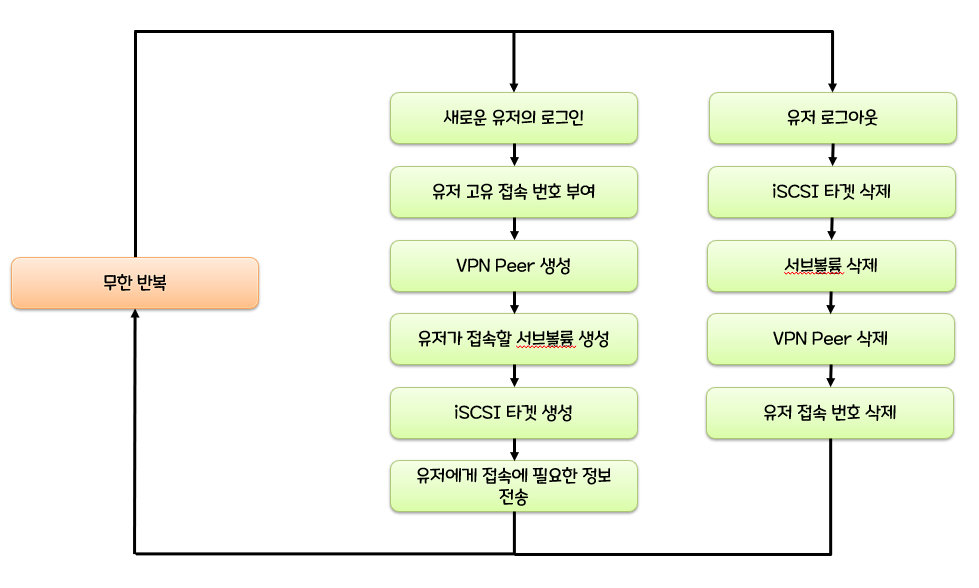
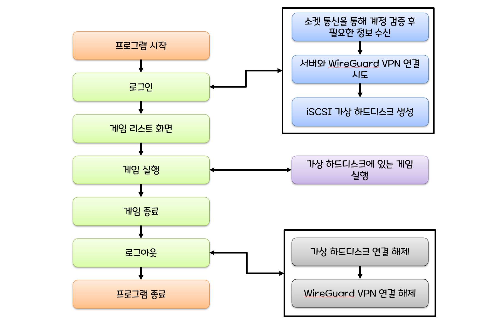

# 파일 스트리밍 방식을 활용한 클라우드 게이밍의 딜레이 개선

## 프로젝트 개요
본 프로젝트는 클라우드 게이밍의 기존 영상 스트리밍 방식이 가진 한계를 보완하기 위해, 새로운 파일 스트리밍 기반 클라우드 게이밍 시스템을 구현했다. 영상 스트리밍 방식은 저사양 기기에서도 게임을 실행할 수 있고, 별도의 다운로드나 업데이트 없이 게임을 즐길 수 있다는 장점이 있지만, 입력 지연과 화질 저하 등의 문제가 발생한다. 반면, 파일 스트리밍 방식은 게임을 설치하지 않아도 되는 장점은 유지하면서도, 입력 지연이나 화질 저하 없이 게임을 실행할 수 있다.

## 프로젝트 파일 설명
- Aduino_Python: 게임 딜레이를 측정하기 위해 실행하는 파이썬 프로그램입니다.
- Aduino_Uno: 게임 딜레이를 측정하기 위해 아두이노 우노에서 실행하는 프로그램입니다.
- Climing-Client: 클라이언트 C++, C# 프로그램입니다.
- Client-Server: 서버 Java 프로그램입니다.
- climing_client_new: C#으로 리펙토링중인 클라이언트 프로그램입니다.
- climing_server_new: SpringBoot로 리펙토링중인 서버 프로그램입니다.

## 사용한 기술 스택
- **서버**: SPECTO 홈 서버, Ubuntu 22.04 LTS, Btrfs 파일 시스템
- **백엔드**: Java, MySQL(JDBC), Wireguard VPN, iSCSI, TCP 소켓 통신, Nginx 웹 서버(이미지 전송용)
- **프론트엔드**: C++/CLI, C#, .NET9, WinForms

## 시연 영상
(나중에 추가하기)

## 클라이언트 프로그램 흐름도

## 서버 프로그램 흐름도

# 참고
폴더명에 _new가 붙은 프로젝트는 현재 리펙토링을 진행중인 미완성 프로젝트입니다.
